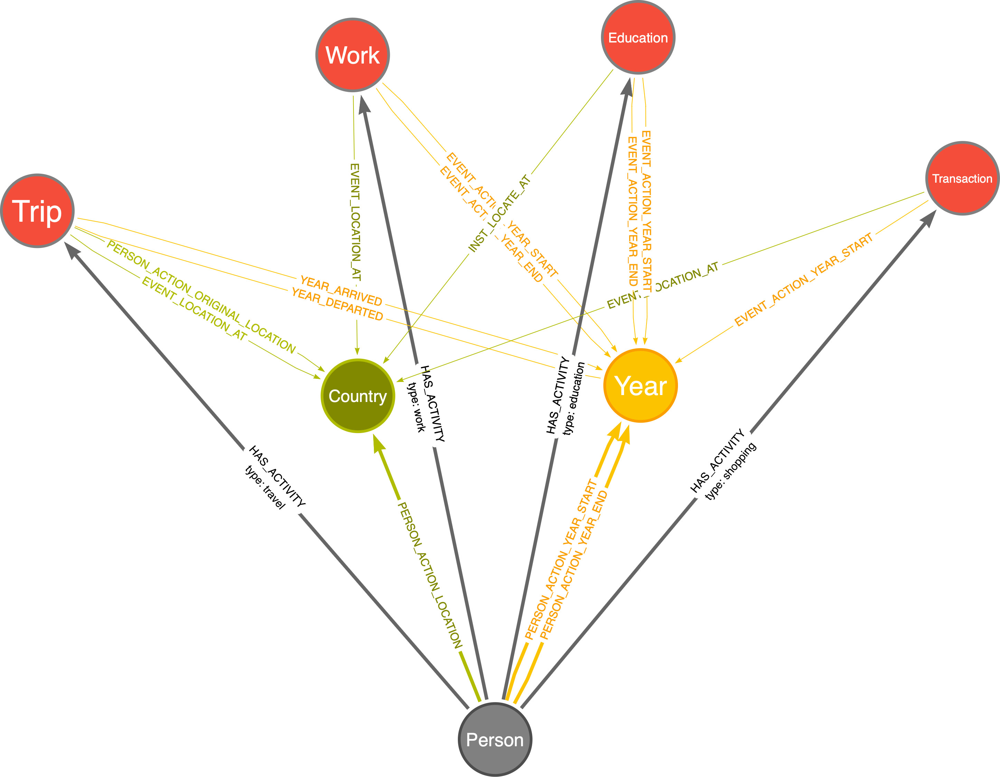
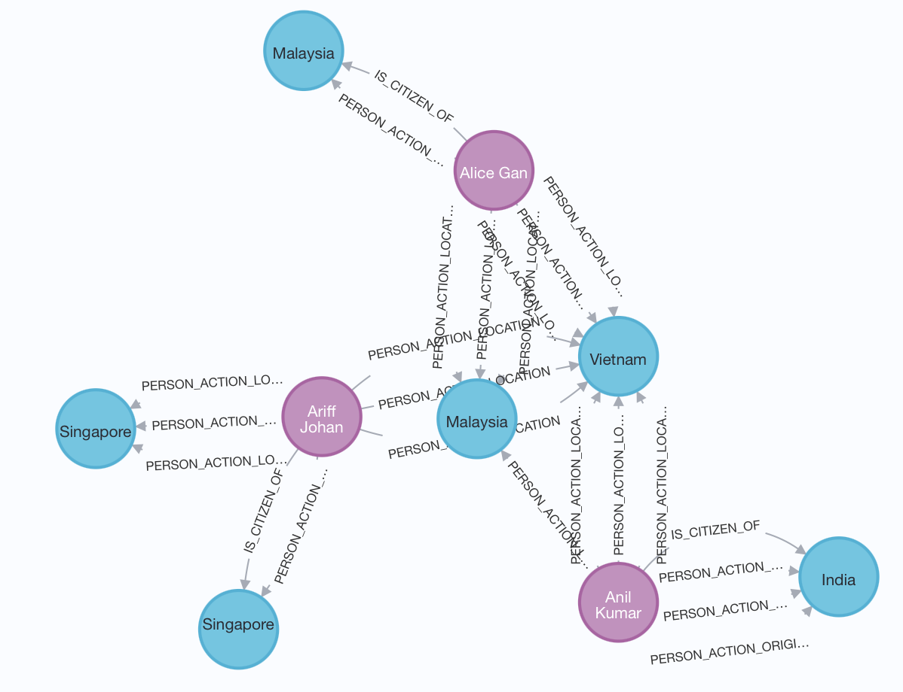

# Neo4j Sample Project
##Set up Neo4j Enterprise (Docker / VM). 
```
docker run \
    -p 7474:7474 -p 7687:7687 \
    -e NEO4J_AUTH=neo4j/s3cr3t\
    -v $PWD/data:/data -v $PWD/plugins:/plugins \
    --name neo4j-apoc \
    -e NEO4J_apoc_export_file_enabled=true \
    -e NEO4J_apoc_import_file_enabled=true \
    -e NEO4J_apoc_import_file_use__neo4j__config=true \
    -e NEO4JLABS_PLUGINS=\[\"apoc\"\] \
    --env NEO4JLABS_PLUGINS='["graph-data-science"]'\
    neo4j
```


## Key Use Cases 
Link to the graph:  
https://arrows.app/#/local/id=CGvPhHgNFdKpruz0pgS1



There are four activities can be identified given the supplied dataset, that is Person node can have 
any of the following four activity nodes:
- Work
- Education
- Trip
- Transaction

In this exercise, I created four nodes for different activities, an alternative way, given the small
amount of data, could be creating an activity node, with a type property set as work, education etc.


To reduce the amount of duplicated data, I further introduced the country and year nodes, as these data are 
presented in all tables. 
Based on the assumed graph, I intend to answer the following use cases:

Fact questions: 
- Has an individual worked/educated/traveled/shopped ? 
- If any activity happened, what is the location?
- Given a particular year, what a person has done? 
- How many times a person has shopped? 

Inference question: 
- Does more educated person shopped more? 

After code execution 103 nodes will be created:
- 30 Transaction nodes
- 3 Person nodes
- 15 Trip nodes
- 18 Country nodes
- 12 Education nodes
- 6 Work nodes
- 19 Year nodes


Please refer to neo4j_test.py for the import application. 


## Test of the database based on use cases

-----
**Case one:** Has Anil Kumar received any education?
```
MATCH (n:Person)-[:HAS_ACTIVITY {type:'education'}]-(e) WHERE n.name = 'Anil Kumar' RETURN e
```
Answer: Anil has received five qualifications 

-----
**Case two:** When and where did Anil Kumar receive her university education?
```
MATCH (n:Person)-[:HAS_ACTIVITY {type:'education'}]-(e:Education)-[:EVENT_LOCATION_AT]-(c:Country)
MATCH (n:Person)-[:HAS_ACTIVITY {type:'education'}]-(e:Education)-[:EVENT_ACTION_YEAR_START]-(y:Year)
WHERE n.name = 'Anil Kumar'
AND e.nameofinstitution CONTAINS 'University' 
RETURN c.name, y.year
```
Answer: 1992 in Vietnam. 


-----
**Case three:** What has Anil Kumar did during 1990-2000 (inclusive)?
```
MATCH (n:Person)-[r:HAS_ACTIVITY]-(e)-[:EVENT_ACTION_YEAR_START]-(y:Year)
WHERE n.name = 'Anil Kumar'
AND 1990<= y.year <=2000
RETURN labels(e)[0], y.year
```
Answer: Anil Kumar started education in 1992 and started work in 1996.

-----
**Case four:** How often does Anil Kumar shop?
```
MATCH (n:Person)-[r:HAS_ACTIVITY {type:'shopping'}]-(e)-[:EVENT_ACTION_YEAR_START]-(y:Year)
WHERE n.name = 'Anil Kumar'
RETURN y.year,count(r)
```
Answer: 10 times in year 2021. 

-----

## Data Insights
### General Individual Similarity 
When looking only at the location based similarity, Alice Gan and Anil Kumar are mostly similar 
```
CALL gds.graph.project(
    'myGraph3',
    ['Country','Person'], 
    'PERSON_ACTION_LOCATION'
)
CALL gds.beta.closeness.stream('myGraph3')
YIELD nodeId, score
RETURN gds.util.asNode(nodeId).name AS name, score
ORDER BY score DESC
Person1	Person2	similarity
"Alice Gan"	"Anil Kumar"	0.181
"Alice Gan"	"Ariff Johan"	0.091
"Anil Kumar"	"Ariff Johan"	0.083
```
The country they visited most (apart from their home country) is Vietnam. 

```
MATCH (p:Person) - [:PERSON_ACTION_LOCATION] - (c:Country)
WHERE p.name = "Alice Gan" or p.name = "Anil Kumar"
Return c.name, count(c.name)
```
Anil Kumar and Ariff Johan are, on the other hand, similar in terms of the activity year. 
```
Person1	Person2	similarity
"Anil Kumar"	"Ariff Johan"	0.666
"Alice Gan"	"Ariff Johan"	0.636
"Anil Kumar"	"Alice Gan"	0.538
```

After including both time and location, we can see all three individuals are quite similar. This is because 
all of them **has studied at Smart National University of Vietnam during 1992 and 1995 for the same degree.** 
They also visited Vietnam in September 2021. 


```
CALL gds.graph.project(
    'myGraph',
    ['Country','Person','Year'], 
    ['PERSON_ACTION_LOCATION','PERSON_ACTION_YEAR_START']
)
CALL gds.beta.closeness.stream('myGraph')
YIELD nodeId, score
RETURN gds.util.asNode(nodeId).name AS name, score
ORDER BY score DESC

Person1	Person2	similarity
"Alice Gan"	"Anil Kumar"	0.375
"Anil Kumar"	"Ariff Johan"	0.375
"Alice Gan"	"Ariff Johan"	0.363
```
### Individual Activities
The linkage between the transaction data and the travel data gives further evidence that all three individuals visited 
Vietnam together on 2021-09-26


```
MATCH (p:Person)-[r:HAS_ACTIVITY {type:'shopping'}]-(e)-[:EVENT_LOCATION_AT]-(c)
WHERE  c.name = "Vietnam" and e.date >= date("2021-09-26")
RETURN p.name, e.merchant,  sum(e.amount)

name	e.merchant	sum(e.amount)
"Alice Gan"	"GRAND COCONUT HOTEL, VIETNAM"	1230.0
"Ariff Johan"	"GRAND COCONUT HOTEL, VIETNAM"	1230.0
"Anil Kumar"	"GRAND COCONUT HOTEL, VIETNAM"	1230.0

match (e) - [:EVENT_ACTION_YEAR_START] - (y:Year) 
match (p:Person) - [:PERSON_ACTION_YEAR_START] - (y:Year) 
match (p:Person) - [:HAS_ACTIVITY] - (e)
match (p:Person) - [:PERSON_ACTION_LOCATION] - (c)
match (e) - [:EVENT_LOCATION_AT] - (c)
where c.name = "Vietnam"
return y,p,e,c
```

Although they graduated from the same place, they work in the same country as their citizenship. 



```
MATCH (p:Person)
CALL {
  WITH p
  MATCH (p:Person)-[:PERSON_ACTION_LOCATION {type:'work'}]-(c)
  RETURN c.name AS work_country
}
CALL {
  WITH p
  MATCH (p:Person)-[:PERSON_ACTION_LOCATION {type:'education'}]-(c)
  RETURN c.name AS education_country
}
RETURN p.name, work_country

p.name	work_country	education_country
"Alice Gan"	"Malaysia"	"Malaysia"
"Alice Gan"	"Malaysia"	"Vietnam"
"Anil Kumar"	"India"	"Malaysia"
"Anil Kumar"	"India"	"Vietnam"
"Ariff Johan"	"Singapore"	"Vietnam"
"Ariff Johan"	"Singapore"	"Singapore"

```


